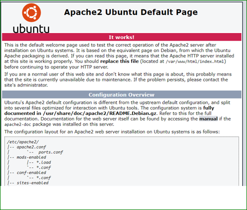

DOCUMENTATION OF PROJECT 1

`sudo apt update`

`sudo apt install apache2`

`sudo systemctl status apache2`

`curl -s http://169.254.169.254/latest/meta-data/public-ipv4`

`sudo apt install mysql-server`

`php -v`
	

 `sudo ls /etc/apache2/sites-available`

`<?php
phpinfo();`

